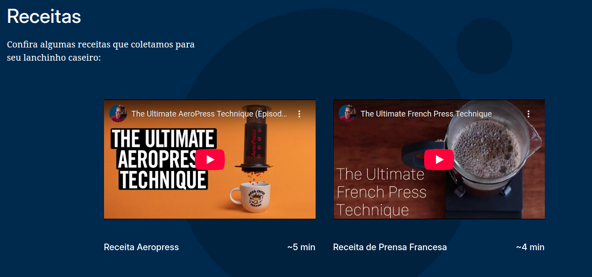
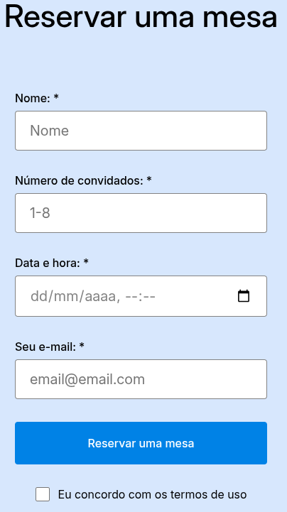

# Projeto Coffeeshop

## Preview

https://michael-ribeiro-fs.github.io/web_project_coffeeshop/

## Tecnologias utilizadas

Metodologia BEM e BEM Flat

Flexbox

HTML Semântico

Normalize.css

Versionamento com Git e uso de repositório GitHub

## Estrutura do Projeto

- blocks → arquivos CSS organizados por blocos utilizando metodologia BEM
- images → imagens utilizadas no projeto
- pages → arquivo CSS principal que importa todos os blocos
- vendor → normalize.css para consistência entre navegadores
- index.html → página principal
- favicon.ico → ícone do site
- .gitignore → configuração para controle de versão

## Descrição do Projeto

Este projeto consiste em uma landing page para um coffeeshop fictício, desenvolvida com foco na organização e estruturação de código front-end. A página apresenta uma hero section, navegação entre seções, incorporação de vídeos explicativos e um formulário de reserva. O layout foi construído utilizando Flexbox e estruturado com HTML semântico. A arquitetura do CSS segue a metodologia BEM com estrutura BEM Flat, permitindo uma separação clara entre blocos e facilitando a manutenção e escalabilidade do código. Também foram implementados pequenos detalhes de interface, como estados de hover em botões e links, além de navegação interna através de âncoras que direcionam o usuário entre as seções da página.

## Melhorias Futuras

- Tornar o layout totalmente responsivo para diferentes tamanhos de tela e dispositivos móveis.

- Implementar JavaScript para validação do formulário e criação de interações mais dinâmicas.

- Adicionar animações sutis em elementos da interface para melhorar a experiência do usuário.
